# Wilderstep: Infinite Abyss — Player's Manual

  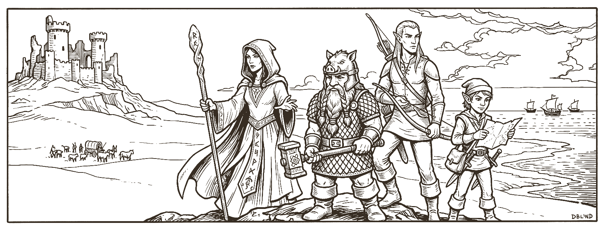

Wilderstep: Infinite Abyss is a turn-based RPG. You assemble a party of adventurers, explore an open world one tile at a time, talk to its people, take on quests, and descend into dungeons full of danger and treasure. This player's manual covers the basic mechanics of the game: races, classes, spells, items, and monsters. The manual is not meant to be comprehensive; Wilderstep is an evolving RPG platform and players will soon be able to craft adventures of their own.

---

**Contents**

- [Getting Started](#getting-started)
  - [Choosing Your Party](#choosing-your-party)
  - [Navigating the Map](#navigating-the-map)
  - [The Combat Arena](#the-combat-arena)
  - [Completing Quests](#completing-quests)
  - [Exploring Dungeons](#exploring-dungeons)
- [Races](#races)
- [Character Classes](#character-classes)
- [Abilities](#abilities)
- [Spells](#spells)
- [Items](#items)
- [Monsters](#monsters)

---

## Getting Started

Wilderstep has three main components: party creation, world exploration, and turn-based combat. 

### Choosing Your Party

A new game opens on the party formation screen, where you build the group you'll lead into the world.

The module provides a starting roster of ready-made characters, and you can also **create your own** from the button at the top of the screen. A custom character is built by picking a race and a class — your race grants innate abilities and adjusts your starting stats, while your class sets your combat role, how far you can move each turn, what weapons and armor you can equip, and which spells (if any) you can learn. The [Races](#races) and [Character Classes](#character-classes) tables lay out every option so you can plan a balanced group.

Characters waiting on the sidelines sit in an **Available** pool; add any of them to fill your ranks, or remove a member to send them back. You can **reorder** the party by dragging members up and down, and order matters: the member in the first slot is your **lead** — the figure shown walking the world map, and the one who acts first in battle. A common setup puts a sturdy front-liner in the lead and keeps fragile spellcasters further back.

When your party is ready, choose **Begin** to enter the world. A good first party mixes durability, damage, and a little magic — a Fighter or Paladin to absorb hits, a Cleric or Wizard for spells, and a Thief or Ranger to handle locks and traps.

### Navigating the Map

Once you begin the game, you will see an icon appear that represents your adventuring party. This icon will be placed on a map that looks something like this:

  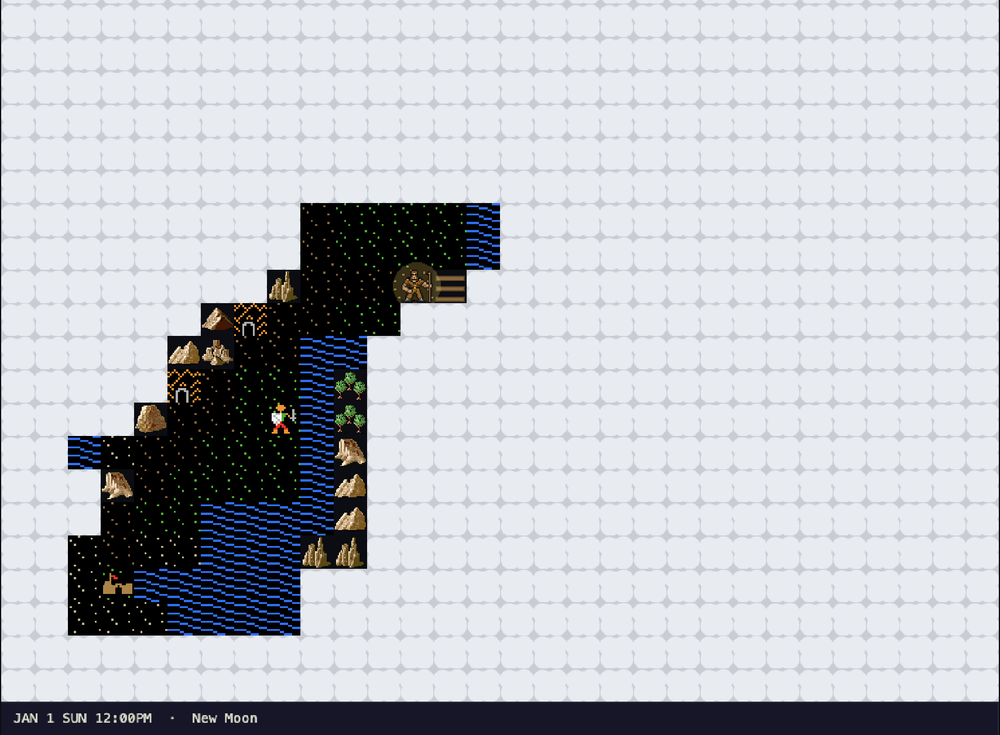

You will see trees, mountains and points of interest like towns depicted on the map. The white "cloud cover" hides areas of the map that you have not explored. At the bottom of the screen you will see a readout that displays the day and time and the moon phase. The map will get dark at night.

You explore the world on a grid, moving **one tile per step** using the controls below.

| Key | Action |
|---|---|
| `↑ ↓ ← →` or `W A S D` | Move the party one tile |
| `Space` | Wait a turn in place (the world still moves around you) |
| `P` | Party screen — roster, gold, shared stash, active effects |
| `Q` | Quest log — active and completed quests |
| `L` | Adventure log — the full back-buffer of in-world messages |
| `H` | Help & tips (and the soundtrack mute / volume controls) |

Almost everything in the world is reached by **walking into it**. Step into a townsperson to talk, into a shop counter to browse its wares, into a locked door to try the lock, and into a quest giver to hear what they need. The same step-to-interact rule covers it all.

Light matters once you leave open daylight. The party carries a light radius that brightens nearby tiles; a lit **Torch** or the **Light** spell extends it, and a Dwarf's Infravision lets that character see in pure darkness without one but only in shades of red. Effects that last for a number of steps — light included — tick down as you move, so keep an eye on the Effects panel of the Party screen (`P`). If a party member can **Detect Traps** (any Thief, or a Ranger from level 3), hidden traps within your light radius show up as red marks before you blunder onto them.

A few other things you'll find out in the world: step onto a boat to sail across water, and onto land to disembark — and unattended shop counters and temples let you trade or buy healing without an NPC to broker it.

### Turn-Based Combat

When the party meets a hostile creature, the game switches to a dedicated **battle screen**: a turn-based arena where your party lines up on one side and the enemies on the other. Turns proceed in order, and your party acts in the order you arranged on the formation screen.

  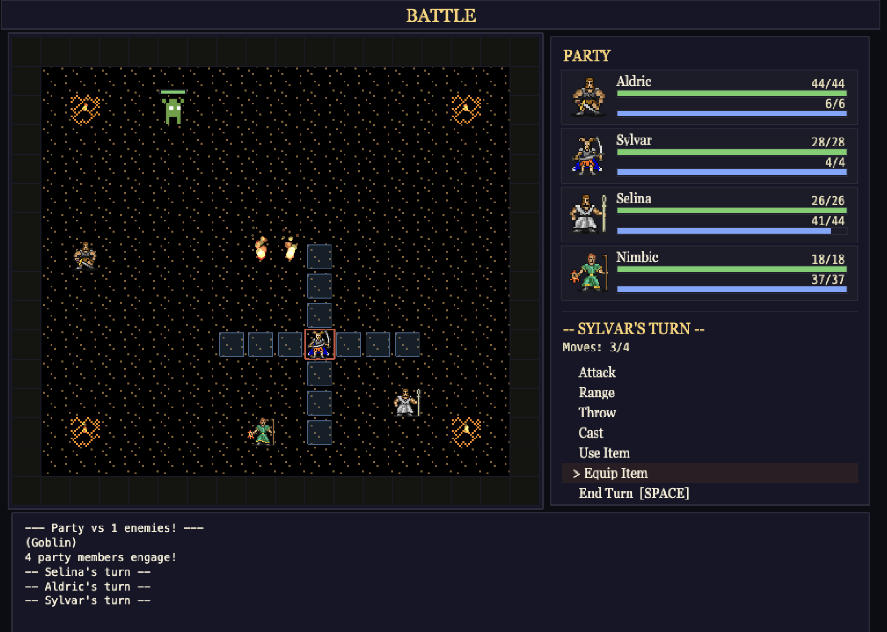

In the battle arena decipted above, you can see the party facing off a goblin. It is the ranger's turn and you can see how many moves he has left. The party status is shown on the right and the current character's options are display below that. The ranger can cast spells, use a ranged weapon, throw a torch, and do a few other things.

On a character's turn you can move up to that class's movement budget (the `Range` value in the [Character Classes](#character-classes) table — a nimble Thief covers far more ground than a Wizard) and then take one action:

| Action | What it does |
|---|---|
| **Attack** | Strike an adjacent enemy with your equipped weapon |
| **Range** | Fire a bow, crossbow, or sling at a distant foe (consumes ammo) |
| **Throw** | Hurl a throwable item — a rock, a flask, a lit torch |
| **Cast** | Spend MP to cast a spell from your catalog |
| **Abilities** | Use a combat ability such as a Cleric's Turn Undead |
| **Use Item** | Drink a potion, apply an antidote, or use another combat consumable |
| **Equip Item** | Swap the weapon or armor you're holding (uses your turn) |
| **End Turn** | Pass to the next combatant |

Controls in the arena:

| Key | Action |
|---|---|
| `↑ ↓ ← →` | Move the cursor, or step the active combatant |
| `Enter` | Activate the highlighted action / confirm a target |
| `1`–`9` | Pick an option from a list (target, spell, item) |
| `Space` | End your turn |
| `Esc` | Cancel the current sub-mode (e.g. back out of the target picker) |

### Darkness in Combat

Your character can only target monsters that he can see, so when fighting in the dark it helps to throw a torch or to cast a light spell.

  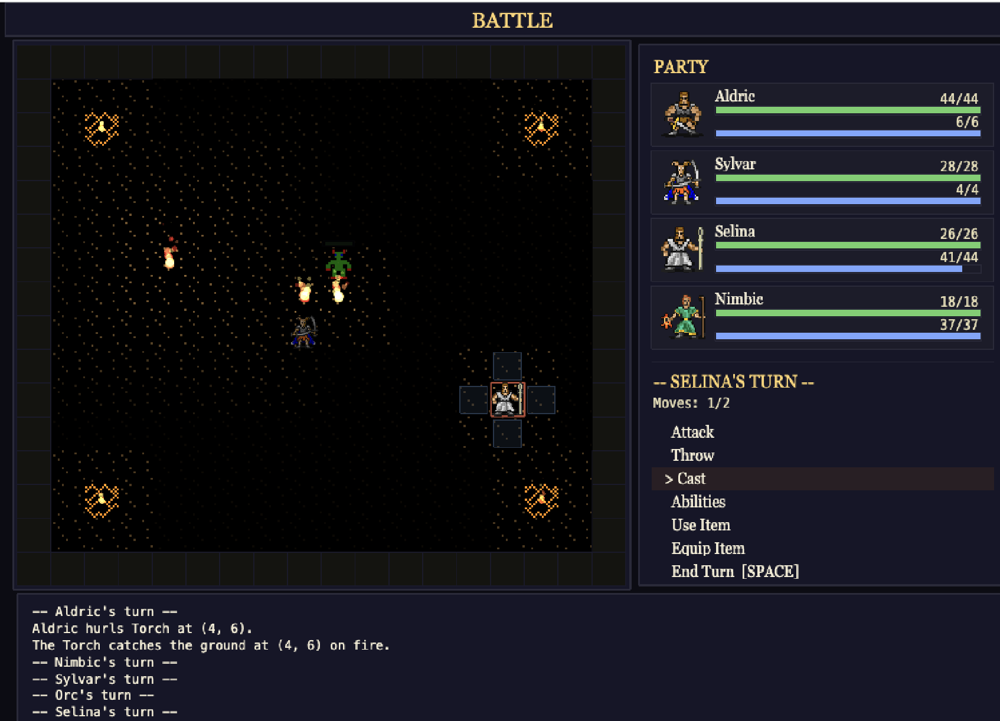

A battle that takes place in darkess is harder because you can't see your enemies at first. Here you can only see one of the orcs that happens to be standing near a torch. The party has already thrown a torch to try and reveal the other orcs. A light spell would work great here.

There is no fleeing — once battle is joined, you fight to win or fall. The fight ends when one side is wiped out; win, and you return to the map with any spoils.

### The Party and Character Sheets

You can view your party and get access to party effects like Detect Traps, Infravision, and more by pressing "P" to get to your party screen. This is where you manage your inventory as well.

  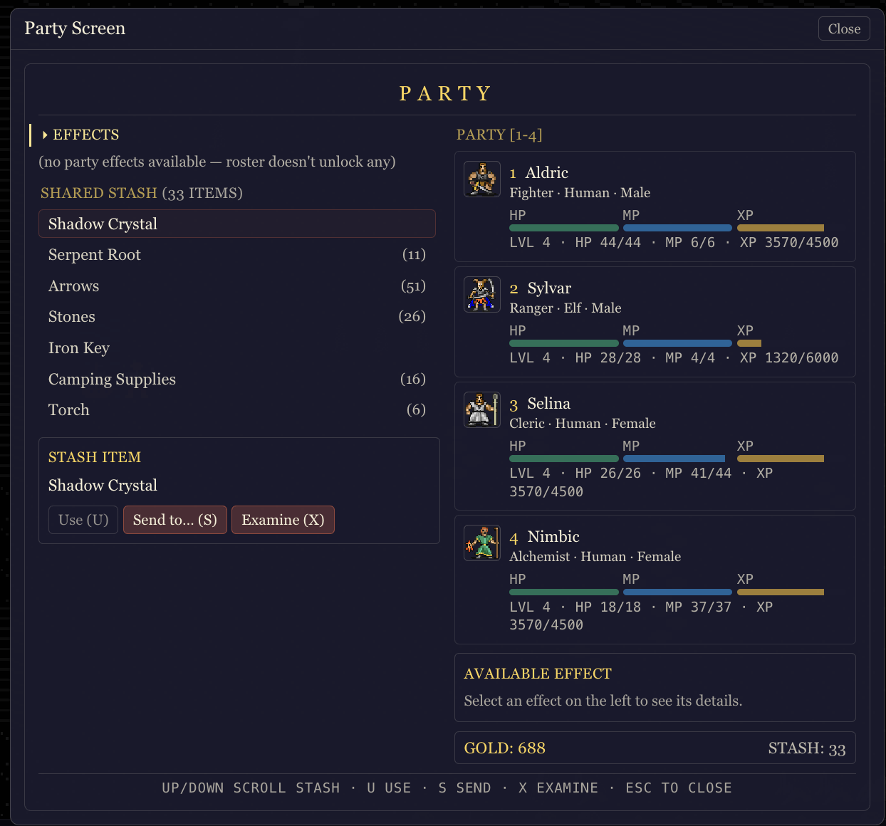

In order to character abilities like crafting potions or arrows, you can select a character to open their character sheet. This will show you the status of your character, gives you a chance to equip items and to use special abilities.

  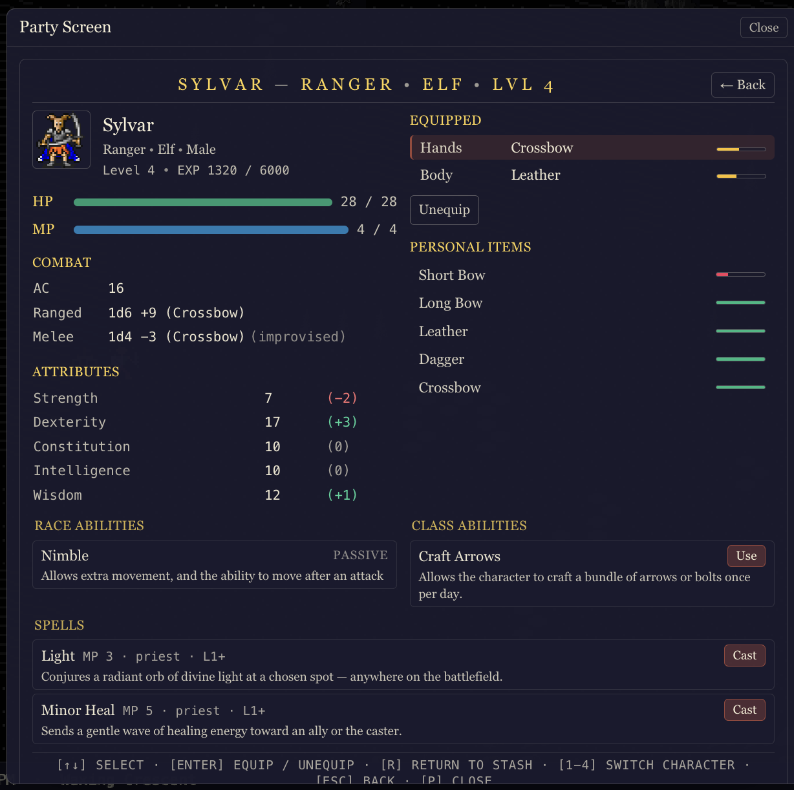

### Completing Quests

Quests are offered by the world's people and markers. Walk into a quest giver and you'll see what they're asking, with the choice to **Accept** or **Decline**. Accepting adds the quest to your log.

Press `Q` at any time to open the **Quest Log**, which shows your active quests and what each still needs from you, alongside the ones you've already finished. As you meet a quest's objectives — defeating a particular foe, reaching a place, recovering an item — your progress updates automatically, and finishing a step or a whole quest is marked with a brief celebration. Rewards (experience, gold, or items) arrive as you complete the work, and some quests change the world itself, opening a path or handing you a key you'll need next.

### Exploring Dungeons

Dungeons are the deep, dangerous heart of the game. Step onto a dungeon entrance on the world map to descend; you'll move through it tile by tile just like the overworld, but dungeons run **multiple floors deep** and are far darker, so a Torch, the Light spell, or a Dwarf's Infravision becomes essential to see what's around you.

Down here you'll find monster **lairs** and waiting **encounters**. Engaging one drops you into the combat arena; importantly, a lair you clear and a placed encounter you defeat are **gone for good** — neither respawns — so every fight you win makes the dungeon a little safer to backtrack through. Watch for traps, pick or unlock the doors barring your way, and gather the treasure the depths are hiding. When you've had your fill (or found what you came for), make your way back to the entrance to return to the surface.

### What Should You Do First?

On your very first playthrough, your party will start off weak with only a few sticks and stones as weapons. If you are lucky, you will have some camping supplies and a handful of gold coins to use for supplies. The world map is full of hostile creatures and dangerous locations, so your best bet is to find the nearest town. Once you in that town, talk to the townspeople and you will find people with interesting things to say about the world you found yourself in. Some people will have quests that you can go on to gain gold and experience and some people will try to sell you their wares.

### Game Saves

Your progress is saved automatically as you play, so you can step away and pick up where you left off. Save games depend on your browser's local storage, which means that saved games will be lost if you reset your browser.

---

## Races

Each race grants a set of innate abilities and applies stat modifiers when a character of that race is rolled.

Most races level up at the same rate. The exception is the **Fast Learner** ability (Humans): a character with it levels up about **25% faster** than everyone else. See [Experience & Leveling](#experience--leveling) under Character Classes for how leveling works.

| Race | STR | DEX | CON | INT | WIS | Abilities |
|---|---:|---:|---:|---:|---:|---|
| **Dwarf** | +2 | -1 | +2 | 0 | +1 | Infravision |
| **Elf** | -1 | +1 | -1 | +2 | 0 | Nimble |
| **Gnome** | -1 | 0 | 0 | +2 | +1 | Tinker |
| **Halfling** | -2 | +2 | 0 | 0 | +1 | Pickpocket |
| **Human** | 0 | 0 | 0 | 0 | 0 | Fast Learner |

## Character Classes

Class determines combat role, movement range per turn, which weapons and armor the character can equip, and which spell catalog (if any) they cast from. `Range` is the per-turn movement budget on the battle grid.

A class's full weapon and armor list appears in its entry in the Class Gallery below.

| Class | Range | Casting | Abilities (min level) |
|---|---:|---|---|
| **Alchemist** | 4 | sorcerer | Herbalism (L1) Brew Potion (L1) |
| **Cleric** | 4 | priest | Turn Undead (L2) |
| **Druid** | 2 | sorcerer, priest | Dual Casting (L1) Herbalism (L1) |
| **Fighter** | 4 | none | — |
| **Paladin** | 4 | priest | Turn Undead (L5) Smite Undead (L1) |
| **Ranger** | 4 | priest | Pick Locks (L5) Craft Arrows (L2) Craft Fire Arrows (L5) |
| **Thief** | 6 | none | Pick Locks (L1) Detect Traps (L1) Backstab (L3) Shadow Step (L7) |
| **Wizard** | 2 | sorcerer | — |

### Experience & Leveling

Characters earn **experience (XP)** by defeating monsters and by completing quests. Every party member who is still standing shares in the reward — each one receives the *full* amount, not a split — and a member who has fallen earns nothing until revived. XP from quests now counts toward leveling immediately, the same as XP from battle.

**Each level costs more than the last.** The cost of advancing from one level to the next is a base of **1,500 experience** multiplied by your *current* level:

- Level 1 → 2 costs 1,500
- Level 2 → 3 costs 3,000
- Level 3 → 4 costs 4,500, and so on.

So the total XP to reach level *N* is `1,500 × N × (N − 1) ÷ 2`. A character with the **Fast Learner** ability (Humans) levels up about **25% faster** — their base is 1,125 instead of 1,500, making every one of those steps cheaper across a whole campaign.

**Leveling up makes a character stronger.** Every new level adds:

- **Hit points** = the class's HP-per-level **plus the character's Constitution modifier** (a high-CON hero gains a little more; the total is never less than +1).
- **Magic points** (spellcasters only) = the class's MP-per-level **plus the character's casting-stat modifier**. Priest casters use Wisdom, sorcerer casters use Intelligence, and the Druid uses the average of the two. Non-casters gain no MP.

These ability modifiers are not a one-time bonus — they apply on **every** level-up, so a high casting stat compounds. A Cleric with Wisdom 16 (a +3 modifier) gains 6 + 3 = **9** MP each level, while one with Wisdom 10 (+0) gains only the base **6**; the same Constitution math rewards a tough fighter with extra HP at every level. This is the payoff for rolling a high primary attribute.

A wounded character is partially healed by the HP and MP a level-up grants.

The per-level amounts are set by class — durable martial classes gain the most HP, while dedicated casters gain the most MP. The numbers below are added *before* the ability-score modifier described above:

<!-- BEGIN GENERATED: leveling-table — run `python3 docs/manual/build_class_gallery.py` to refresh -->

| Class | HP / level (base) | MP / level (base) | Casting stat |
|---|---:|---:|---|
| **Alchemist** | 4 | 4 | Intelligence |
| **Cleric** | 6 | 6 | Wisdom |
| **Druid** | 6 | 6 | Int & Wis (avg) |
| **Fighter** | 8 | — | — |
| **Paladin** | 8 | 4 | Wisdom |
| **Ranger** | 6 | 2 | Wisdom |
| **Thief** | 6 | — | — |
| **Wizard** | 4 | 8 | Intelligence |
<!-- END GENERATED: leveling-table -->

So MP growth is **not** the same for every caster: a **Wizard** gains the most (8 per level), a **Cleric** and a **Druid** gain 6, a **Paladin** or **Alchemist** gain 4, and a **Ranger** gains 2. A Druid therefore gains less MP per level than a Wizard, but the same as a Cleric. Fighters and Thieves are non-casters and gain no MP at all.

<!-- BEGIN GENERATED: class-gallery — run `python3 docs/manual/build_class_gallery.py` to refresh -->

### Class Gallery

A closer look at each class — how it plays, and what it brings to the party. _(This section is generated from `character_classes.json`; edit the data, not the prose here.)_

#### Alchemist

<table><tr>
<td width="170">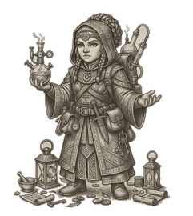</td>
<td>

A support specialist who turns the wild into an arsenal. Alchemists forage reagents (Herbalism) and Brew Potions from level 1, keeping the party stocked with healing and buffs. They cast from the sorcerer catalog but fight poorly — only a dagger, sling, and cloth — so they shine in the back ranks as a crafter and caster.

</td>
</tr></table>

| Move | Casting | Weapons & Armor | Abilities |
|:--:|:--|:--|:--|
| 4 | Sorcerer | 4 weapon types · up to cloth armor | Brew Potion (L1), Herbalism (L1) |

#### Cleric

<table><tr>
<td>

The party's divine anchor. Clerics draw on the priest catalog to heal and protect, wade in wearing chain with a mace or sling, and from level 2 can Turn Undead to wither the unliving. Slow on their feet at two tiles a turn, they reward patient, central positioning over aggression.

</td>
<td width="170">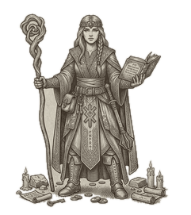</td>
</tr></table>

| Move | Casting | Weapons & Armor | Abilities |
|:--:|:--|:--|:--|
| 4 | Priest | 5 weapon types · up to chain armor | Turn Undead (L2) |

#### Druid

<table><tr>
<td width="170">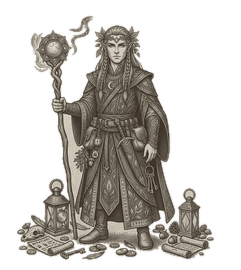</td>
<td>

The only class that wields both arcane and divine magic, thanks to Dual Casting from level 1. Druids forage for reagents as they travel (Herbalism) and fight in leather with simple weapons. Versatile but slow at two tiles a turn and squishier than a true warrior — a flexible spellcaster for players who like options.

</td>
</tr></table>

| Move | Casting | Weapons & Armor | Abilities |
|:--:|:--|:--|:--|
| 2 | Sorcerer + Priest | 6 weapon types · up to leather armor | Dual Casting (L1), Herbalism (L1) |

#### Fighter

<table><tr>
<td>

The workhorse of any party. Fighters command the widest armory in the game — every weapon family from fists to halberds and every armor from cloth to plate — and cover a brisk four tiles a turn. They cast no spells and have no special tricks; their strength is sheer durability and reliability, which makes them ideal in the lead slot soaking the first blows.

</td>
<td width="170">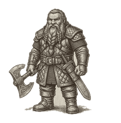</td>
</tr></table>

| Move | Casting | Weapons & Armor | Abilities |
|:--:|:--|:--|:--|
| 4 | No spells | All weapons & armor | — |

#### Paladin

<table><tr>
<td width="170">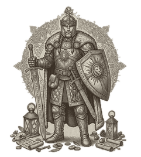</td>
<td>

A holy warrior who fights on the front line and channels divine power. Paladins move four tiles a turn, wear chain and wield swords and spears, Smite Undead for double damage from level 1, and gain Turn Undead at level 5. They trade the Cleric's spell depth for martial muscle — the party's anti-undead vanguard.

</td>
</tr></table>

| Move | Casting | Weapons & Armor | Abilities |
|:--:|:--|:--|:--|
| 4 | Priest | 12 weapon types · up to chain armor | Smite Undead (L1), Turn Undead (L5) |

#### Ranger

<table><tr>
<td>

A wilderness hunter built around ranged combat. Rangers favor bows — the crossbow included — and craft their own Arrows (level 2) and Fire Arrows (level 5) so they never run dry. They draw on a small priest catalog, pick locks from level 5, and move a nimble four tiles a turn: a self-sufficient skirmisher.

</td>
<td width="170">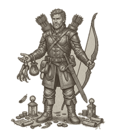</td>
</tr></table>

| Move | Casting | Weapons & Armor | Abilities |
|:--:|:--|:--|:--|
| 4 | Priest | 8 weapon types · up to leather armor | Craft Arrows (L2), Craft Fire Arrows (L5), Pick Locks (L5) |

#### Thief

<table><tr>
<td width="170">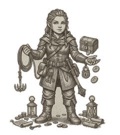</td>
<td>

The fastest, sneakiest member of any party, covering six tiles a turn. Thieves pick locks and spot traps from level 1, land devastating Backstab criticals with daggers from level 3, and at level 7 can Shadow Step to move again after striking. Lightly armored and non-magical, they win through speed, utility, and hit-and-run positioning.

</td>
</tr></table>

| Move | Casting | Weapons & Armor | Abilities |
|:--:|:--|:--|:--|
| 6 | No spells | 5 weapon types · up to leather armor | Detect Traps (L1), Pick Locks (L1), Backstab (L3), Shadow Step (L7) |

#### Wizard

<table><tr>
<td>

A glass cannon of raw arcane power. Wizards cast from the sorcerer catalog but are the frailest class — limited to cloth and a dagger or club, and only two tiles of movement. Keep them well behind the front line: their spells can decide a fight, but a single solid hit can end them.

</td>
<td width="170">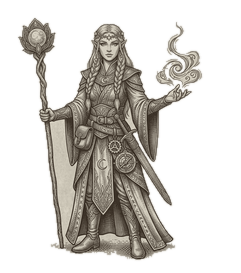</td>
</tr></table>

| Move | Casting | Weapons & Armor | Abilities |
|:--:|:--|:--|:--|
| 2 | Sorcerer | 4 weapon types · up to cloth armor | — |

<!-- END GENERATED: class-gallery -->

## Abilities

Abilities are named capabilities granted by Race or Class (or other sources). The `Where` column tells you where the ability can be triggered: `battle` (combat action menu), `party` (Use button on the character sheet), or `passive` (always-on / auto-triggered).

### Class Abilities

| Ability | Description | Where | Duration |
|---|---|---|---|
| **Backstab** | Critical hits with daggers on a successful DEX save — the humble dagger becomes a devastating weapon. | passive | permanent |
| **Brew Potion** | Combine regents using the guidance of a recipe to create a potion | party |  |
| **Craft Arrows** | Allows the character to craft a bundle of arrows or bolts once per day. | party |  |
| **Craft Fire Arrows** | Allows the character to craft a bundle of fire arrows once per day. | party |  |
| **Detect Traps** | Hidden traps are revealed before the party steps on them. | passive | permanent |
| **Dual Casting** | Access to both the priest and sorcerer spell catalogs — the only class with both. | passive | permanent |
| **Herbalism** | Nature lore spots reagents in the wild while travelling. Each step on a foraging tile (grass, forest, …) has a small chance to turn up a potion reagent. Alchemists in particular benefit from a doubled find rate. | passive | permanent |
| **Pick Locks** | Pick locked doors and chests — d20 + DEX mod vs DC 12, one lockpick consumed per attempt. | passive | permanent |
| **Shadow Step** | Move after attacking — true hit-and-run play. | passive | permanent |
| **Smite Undead** | Attacks against undead creatures deal double damage | passive |  |
| **Turn Undead** | Channel holy energy at every undead on the battlefield. Each one must make a Wisdom save (d20 + WIS mod vs DC 10 + caster's WIS mod) or be destroyed outright; those that succeed are still seared for 50% of their HP in radiant damage. Powerful undead (vampires, liches, …) add their turn resistance to the save and are never destroyed outright — on a failed save they are seared and TURNED, fleeing the holy light for 1d4 turns. | battle | instant |

### Race Abilities

| Ability | Description | Where | Duration |
|---|---|---|---|
| **Fast Learner** | Requires only 1125 XP per level instead of the standard 1500, leveling up roughly 25% faster than other races. | passive | permanent |
| **Infravision** | Pierces darkness, revealing the world in shades of red. The bearer can see in absolute darkness without needing a torch. | passive | permanent |
| **Nimble** | Allows extra movement, and the ability to move after an attack | passive | permanent |
| **Pickpocket** | Attempt to steal items from town NPCs. Once per NPC, with a chance of failure. | party | permanent |
| **Tinker** | Once per in-game day, fashion any single item normally found in a general store. | party | permanent |

<!-- BEGIN GENERATED: spells — run `python3 docs/manual/build_spells.py` to refresh -->

## Spells

Spells are MP-cost actions castable by classes that have a matching `casting_type`. The `Where` column tells you where the spell can be cast — `battle`, `party`, or `context` (contextual surfaces like the locked-door dialog). _(This section is generated from `spells.json`; edit the data, not the prose here.)_

### Priest Spells

| Spell | MP | Min Lvl | Range | Targeting | Where | Description |
|---|---:|---:|---:|---|---|---|
| **Light** | 3 | 1 | 0 | select_tile | party, battle | Conjures a radiant orb of divine light at a chosen spot — anywhere on the battlefield. |
| **Minor Heal** | 5 | 1 | 6 | select_ally_or_self | battle, party | Sends a gentle wave of healing energy toward an ally or the caster. |
| **Cure Poison** | 5 | 2 | 99 | select_ally | battle | Draws the venom from an ally's body with a cleansing prayer, removing the poisoned condition. |
| **Bless** | 10 | 3 | 0 | self | battle | Invokes a divine blessing that empowers all allies, granting them greater accuracy in battle. |
| **Curse** | 10 | 3 | 99 | select_enemy | battle | Calls down a dark malediction on an enemy, weakening its defenses and dulling its attacks. |
| **Major Heal** | 15 | 4 | 10 | select_ally_or_self | battle | Channels a powerful wave of restorative energy toward an ally, mending grievous wounds. |
| **Push** | 14 | 5 | 0 | self | party | Emits a powerful wave of divine force that drives nearby monsters away from the party. |
| **Mass Heal** | 25 | 6 | 0 | self | battle | A burst of divine light radiates from the caster, restoring health to all nearby allies. |
| **Restore** | 35 | 7 | 0 | self | battle | A radiant pillar of divine power engulfs the party, fully restoring health to all allies and mana to everyone but the caster, purging all poisons from their bodies. |
| **Daylight** | 20 | 8 | 0 | self | battle | Floods the entire battlefield with brilliant daylight for the rest of the battle, banishing every shadow. |
| **Divine Smite** | 60 | 9 | 6 | select_enemy | battle | Calls down a searing column of holy radiance that scours a single enemy — and burns the undead half again as hard. |
| **Resurrection** | 50 | 10 | 6 | select_ally | party | Channels life back into a fallen companion, raising them from the dead at half their full strength. |

### Sorcerer Spells

| Spell | MP | Min Lvl | Range | Targeting | Where | Description |
|---|---:|---:|---:|---|---|---|
| **Shield** | 4 | 1 | 5 | select_ally | battle | Conjures a faint magical barrier around an ally, slightly boosting their armor. |
| **Sleep** | 5 | 1 | 99 | select_enemy | battle | Lulls a weak-minded creature into a light magical slumber. |
| **Magic Dart** | 6 | 1 | 10 | directional_projectile | battle | Hurls an energy-charged dart in a straight line, stinging on impact. |
| **Knock** | 6 | 2 | 1 | self | context | Sends a pulse of arcane force into a lock's mechanism, rattling tumblers and wards alike. Cast from the locked-door dialog when the party bumps a lock. |
| **Long Shanks** | 6 | 2 | 99 | select_ally_or_self | battle | Enchants an ally's legs with unnatural speed, extending their movement range for 3 turns. May also be cast on yourself. |
| **Magic Arrow** | 12 | 3 | 99 | select_enemy | battle | Conjures a piercing bolt of arcane energy that streaks toward a chosen foe. |
| **Misty Step** | 8 | 4 | 6 | select_tile | battle | The caster vanishes in a swirl of silvery mist and reappears at a chosen location on the battlefield. |
| **Invisibility** | 16 | 4 | 0 | self | battle | The caster bends light around themselves, becoming invisible to enemies for 3 turns. |
| **Charm Person** | 14 | 5 | 99 | select_enemy | battle | Weaves an enchantment that bends the will of a humanoid creature, turning it against its allies for 3 turns. |
| **Lightning Bolt** | 25 | 5 | 99 | directional_projectile | battle | Unleashes a searing bolt of lightning that streaks in a straight line, electrocuting everything in its path. |
| **Animate Dead** | 20 | 6 | 99 | select_tile | battle | Raises a powerful skeleton warrior from the earth to fight for the caster. |
| **Fireball** | 30 | 7 | 99 | select_tile | battle | Hurls a massive ball of flame that detonates in a 3-tile radius, scorching everything — friend or foe — caught in the blast. |
| **Recall** | 25 | 8 | 0 | self | party | Folds space around the whole party, drawing them back to their last rune stone — or, if none was placed, to where their journey began. |
| **Meteor Shower** | 70 | 9 | 99 | auto_monster | battle | Calls a rain of blazing meteors down on every foe on the battlefield, scorching them all at once. |
| **Void Orb** | 80 | 10 | 99 | select_enemy | battle | Conjures a sphere of absolute void that collapses on a single enemy, unmaking them with devastating force. |

<!-- END GENERATED: spells -->

<!-- BEGIN GENERATED: items — run `python3 docs/manual/build_items.py` to refresh -->

## Items

Items are grouped by category, one table each. **Weapons** list **Base Damage** — the dice the weapon rolls before the wielder's Strength/Dexterity modifier and any magical Damage Bonus — with all melee weapons first, then all ranged, each ordered weakest to strongest. **Armor** lists **Base AC**, the Armor Class a typical adventurer has while wearing it, ordered least to most protective. The remaining tables cover consumables, ammunition, reagents, quest items, and the like; their **Type** column names the exact kind.

### Weapons

| Icon | Item | Type | Base Damage | Durability | Damage Bonus | Damage Type | Special | Buy |
|:---:|---|---|---:|---:|---|---|---|---:|
|  | **Fists** | Fists | 1 | 0 |  |  |  |  |
|  | **Club** | Club | 1d4-1 | 12 |  |  |  | 20 |
| 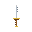 | **Dagger** | Dagger | 1d4-1 | 20 |  |  | throwable | 20 |
| 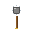 | **Mace** | Mace | 1d4 | 20 |  |  |  | 40 |
| 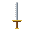 | **Sword** | Sword | 1d6 | 20 |  |  |  | 40 |
|  | **Spear** | Spear | 1d8 | 20 |  |  |  | 50 |
| 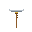 | **Broad Axe** | Axe | 1d8 | 20 |  |  |  | 0 |
|  | **Iron Sword** | Sword | 1d8 | 50 |  |  |  | 0 |
| 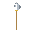 | **Halberd** | Halberd | 1d10 | 20 |  |  |  | 0 |
|  | **Rimefang Dagger** | Dagger | 2d6 | 0 | 1d6 | ice | throwable | 0 |
|  | **Meteorfall Mace** | Mace | 2d8 | 0 | 1d8 | meteor |  | 0 |
|  | **Sun Sword** | Sword | 2d8 | 0 | 1d6 | fire |  | 0 |
|  | **Rock** | Rock | 1d6+1 | 0 |  |  | ranged, throwable | 0 |
| 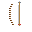 | **Sling** | Sling | 1d6+2 | 20 |  |  | ranged, uses stones | 60 |
|  | **Short Bow** | Short Bow | 1d6+4 | 30 |  |  | ranged, uses arrows | 60 |
|  | **Long Bow** | Long Bow | 1d6+7 | 20 |  |  | ranged, uses arrows | 150 |
|  | **Crossbow** | Crossbow | 1d6+9 | 20 |  |  | ranged, uses bolts | 250 |
|  | **Silver Bow** | Long Bow | 1d6+9 | 0 |  |  | ranged, uses arrows |  |
|  | **Dawnlight Bow** | Short Bow | 1d6+16 | 0 | 1d6 | light | ranged, uses arrows | 0 |
|  | **Starcaller Wand** | Wand | 1d6+16 | 0 | 1d8 | arcane | ranged | 0 |
|  | **Starfall Sling** | Sling | 1d6+16 | 0 | 1d6 | meteor | ranged, uses stones | 0 |
|  | **Stormbolt Crossbow** | Crossbow | 1d6+18 | 0 | 1d6 | lightning | ranged, uses bolts | 0 |

### Armor

| Icon | Item | Type | Base AC | Durability | Buy | Sell |
|:---:|---|---|---:|---:|---:|---:|
|  | **Cloth** | Cloth | 11 | 0 | 20 | 10 |
|  | **Leather** | Leather | 13 | 20 | 50 | 25 |
|  | **Chain** | Chain | 14 | 50 | 120 | 60 |
|  | **Plate** | Plate | 15 | 20 | 200 | 150 |
|  | **Stoneguard Plate** | Plate | 18 | 0 | 0 | 0 |

### Ammo

| Icon | Item | Type | Power | Effect | Charges | Stackable | Buy | Description |
|:---:|---|---|---:|---|---:|:---:|---:|---|
|  | **Arrows** | Ammo |  |  | 20 | ✓ | 5 | A bundle of arrows for bows. |
|  | **Bolts** | Ammo |  |  | 20 | ✓ | 8 | Heavy crossbow bolts with iron tips. |
|  | **Fire Arrows** | Ammo | 3 |  | 20 | ✓ | 25 | A bundle of fire arrows. Fire arrows explode on impact and produce the same effect as a thrown torch — they light the tile they land on and damage anyone standing in it. |
|  | **Fire Bolts** | Ammo | 3 |  | 20 | ✓ | 30 | A bundle of fire bolts for crossbows. Tipped with the same alchemical compound as fire arrows — they explode on impact, lighting the tile they land on and damaging anyone standing in it. |
|  | **Stones** | Ammo |  |  | 20 | ✓ | 3 | A pouch of smooth stones for slings. |

### Potions

| Icon | Item | Type | Power | Effect | Charges | Stackable | Buy | Description |
|:---:|---|---|---:|---|---:|:---:|---:|---|
|  | **Antidote** | Antidote |  | cure_poison | 1 | ✓ | 10 | A bitter tincture that cures poison. |
|  | **Lingering Venom** | Poison Potion | 2 | combat_only |  |  | 70 | A potent toxin that persists far longer than ordinary poisons. |
|  | **Paralytic Poison** | Poison Potion | 2 | combat_only |  |  | 75 | A nerve toxin that drains magical energy. Apply to a weapon or throw at enemies. |
|  | **Poison Vial** | Poison Potion | 2 | combat_only |  |  | 50 | A vial of toxic liquid. Apply to a weapon or throw at enemies to inflict poison damage. |
|  | **Weakening Poison** | Poison Potion | 2 | combat_only |  |  | 60 | A venom that saps fighting prowess. Apply to a weapon or throw at enemies. |
|  | **Elixir of Strength** | Potion | 2 | buff_strength | 1 | ✓ | 60 | A thick crimson brew. Grants +2 STR for the next combat. |
|  | **Elixir of Warding** | Potion | 2 | buff_ac | 1 | ✓ | 60 | A silver-tinged potion. Grants +2 AC for the next combat. |
|  | **Healing Potion** | Potion | 30 | heal_hp | 1 | ✓ | 40 | A ruby-red elixir that mends wounds. Restores a large amount of HP. |
|  | **Mana Potion** | Potion | 10 | heal_mp | 1 | ✓ | 40 | A shimmering blue liquid that restores magic points. |
|  | **Fire Oil** | Throwable | 20 |  |  |  | 35 | A volatile oil that bursts into a small 3x3 gout of flame where it lands. Throw at an enemy or tile. |

### Scrolls

| Icon | Item | Type | Power | Effect | Charges | Stackable | Buy | Description |
|:---:|---|---|---:|---|---:|:---:|---:|---|
|  | **Scroll of Fire** | Scroll |  |  |  |  |  | A single-use scroll containing a fire spell. |

### Reagents

| Icon | Item | Type | Power | Effect | Charges | Stackable | Buy | Description |
|:---:|---|---|---:|---|---:|:---:|---:|---|
|  | **Brimite Ore** | Reagent |  |  | 1 | ✓ | 15 | A volatile mineral that smolders with inner heat. |
|  | **Glowcap Mushroom** | Reagent |  |  | 1 | ✓ | 10 | A blue-capped fungus that pulses with arcane energy. |
|  | **Moonpetal** | Reagent |  |  | 1 | ✓ | 12 | A luminous flower petal that glows faintly in the dark. Prized by alchemists. |
|  | **Serpent Root** | Reagent |  |  | 1 | ✓ | 8 | A twisted root with potent cleansing properties. |
|  | **Spring Water** | Reagent |  |  | 1 | ✓ | 3 | Pure water from a mountain spring. Essential for brewing. |

### Quest Items

| Icon | Item | Type | Power | Effect | Charges | Stackable | Buy | Description |
|:---:|---|---|---:|---|---:|:---:|---:|---|
|  | **Chest** | Chest | 0 |  |  |  | 0 | A lost chest |
|  | **Relic Chest** | Chest | 0 |  |  |  | 0 | A chest containing a relic |
|  | **Treasure Chest** | Chest | 0 |  |  |  | 0 | What treasure lies inside? |
|  | **Dragonheart** | Quest Item |  |  |  |  |  | The smoldering heart of an ancient wyrm. It beats once every few minutes, slow as the tide, and the air around it shimmers with heat. |
|  | **Family Heirloom** | Quest Item |  |  |  |  |  | A delicate silver locket engraved with a family crest. It belongs to Elara. |
|  | **Shadow Crystal** | Quest Item |  |  |  |  |  | A pulsing dark crystal radiating ancient power. The innkeeper seeks this. |

### General Items

| Icon | Item | Type | Power | Effect | Charges | Stackable | Buy | Description |
|:---:|---|---|---:|---|---:|:---:|---:|---|
|  | **Camping Supplies** | Camping Supplies | 0 | rest | 3 | ✓ | 25 | A bedroll, flint, and dried rations. Lets the party rest safely in the wilderness. |
|  | **Healing Herb** | Herb | 15 | heal_hp | 1 | ✓ | 15 | A fragrant herb that restores a small amount of HP. |
|  | **Iron Key** | Key |  |  |  |  | 10 | A heavy iron key that can unlock one locked door. |
|  | **Lockpick** | Lockpick |  |  | 5 | ✓ | 8 | A set of fine lockpicking tools. Consumed on each attempt. |
|  | **Silver Key** | Quest Item |  |  |  |  |  | A gleaming silver key inscribed with arcane formulae. One of the 8 Keys of Shadow. |
| 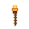 | **Torch** | Torch | 3 |  | 1 | ✓ | 5 | A wooden torch. Lights the way in dark places. |

<!-- END GENERATED: items -->

<!-- BEGIN GENERATED: monsters — run `python3 docs/manual/build_monsters.py` to refresh -->

## Monsters

Every monster in the game, sorted by difficulty (easy → normal → hard → deadly → boss), then by HP. **Damage** is the attack dice; **Move** is the tile budget per turn. The **Tags** column notes type (undead / humanoid — undead matters for Smite Undead and Turn Undead) and hit-and-run behaviour.

| Sprite | Monster | Diff | HP | AC | Atk | Damage | Move | XP | Gold | Tags |
|:---:|---|---|---:|---:|---:|---|---:|---:|---:|---|
|  | **Goblin** | easy | 6 | 11 | +2 | 1d4 | 6 | 10 | 1–6 | humanoid |
| 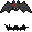 | **Cave Bat** | easy | 8 | 12 | +2 | 1d4 | 12 | 20 | 2–8 |  |
|  | **Giant Rat** | easy | 8 | 12 | +2 | 1d4 | 10 | 15 | 2–8 |  |
|  | **Giant Centipede** | easy | 10 | 12 | +2 | 1d4 | 8 | 20 | 2–8 |  |
|  | **Wild Eagle** | easy | 10 | 12 | +2 | 1d4 | 12 | 20 | 2–8 |  |
|  | **Fire Beetle** | easy | 12 | 14 | +2 | 1d4 | 8 | 20 | 2–8 |  |
|  | **Wolf** | easy | 12 | 13 | +4 | 1d6+1 | 4 | 30 | 0–5 |  |
|  | **Spider** | easy | 15 | 12 | +10 |  | 4 | 25 | 1–5 | hit-and-run 2 |
|  | **Wild Boar** | easy | 15 | 14 | +1 | 1d4 | 4 | 20 | 3–10 |  |
|  | **Skeleton Archer** | normal | 12 | 12 | +3 | 1d4 | 2 | 20 | 5–18 | undead |
|  | **Dark Mage** | normal | 14 | 12 | +4 | 2d4+1 | 2 | 50 | 10–25 | humanoid |
|  | **Orc Shaman** | normal | 16 | 11 | +3 | 1d4 | 2 | 25 | 5–18 | humanoid |
|  | **Pirate** | normal | 16 | 13 | +2 | 1d4 | 6 | 25 | 5–10 | humanoid, hit-and-run 2 |
|  | **Skeleton** | normal | 16 | 13 | +3 | 1d6+1 | 3 | 30 | 5–15 | undead |
|  | **Zombie** | normal | 20 | 10 | +2 | 1d6+1 | 3 | 30 | 3–12 | undead |
|  | **Blue Ooze** | normal | 22 | 10 | +3 | 1d8+1 | 4 | 45 | 5–18 |  |
|  | **Coil Serpent** | normal | 22 | 13 | +3 | 1d8+1 | 7 | 45 | 5–18 |  |
|  | **Crimson Spider** | normal | 22 | 13 | +3 | 1d8+1 | 7 | 45 | 5–18 |  |
|  | **Imp** | normal | 22 | 13 | +3 | 1d8+1 | 9 | 45 | 5–18 | humanoid |
|  | **Kobold Shaman** | normal | 22 | 13 | +3 | 1d8+1 | 7 | 45 | 5–18 | humanoid |
|  | **Orc** | normal | 22 | 13 | +5 | 1d8+2 | 4 | 50 | 5–15 | humanoid |
|  | **Restless Spirit** | normal | 22 | 14 | +3 | 1d8+1 | 8 | 45 | 5–18 | undead |
|  | **Skeleton Warrior** | normal | 22 | 14 | +3 | 1d8+1 | 7 | 45 | 5–18 | undead, humanoid |
|  | **Fire Lizard** | normal | 26 | 13 | +3 | 1d8+1 | 7 | 45 | 5–18 |  |
|  | **Orc Raider** | normal | 26 | 13 | +3 | 1d8+1 | 7 | 45 | 5–18 | humanoid |
|  | **Troll** | normal | 30 | 14 | +6 | 2d6+2 | 1 | 70 | 10–25 | humanoid |
|  | **Lich** | hard | 30 | 15 | +3 | 3d4 | 2 | 135 | 10–40 | undead |
|  | **Banshee** | hard | 35 | 13 | +5 | 1d8 | 3 | 90 | 8–25 | undead, hit-and-run 1 |
|  | **Ogre** | hard | 40 | 13 | +5 | 2d6+3 | 2 | 80 | 15–40 | humanoid |
|  | **Super Zombie** | hard | 40 | 11 | +4 | 1d8+2 | 2 | 70 | 6–22 | undead |
|  | **Cursed Mummy** | hard | 45 | 15 | +4 | 2d6+2 | 5 | 100 | 15–45 | undead, humanoid |
|  | **Gargoyle** | hard | 45 | 16 | +4 | 2d6+2 | 8 | 100 | 15–45 |  |
|  | **Ice Golem** | hard | 45 | 16 | +4 | 2d6+2 | 5 | 100 | 15–45 |  |
|  | **Medusa** | hard | 45 | 15 | +4 | 2d6+2 | 6 | 100 | 15–45 | humanoid |
| 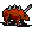 | **Raptor Beast** | hard | 45 | 15 | +4 | 2d6+2 | 8 | 100 | 15–45 |  |
|  | **Daemon** | hard | 48 | 15 | +5 | 2d6+1 | 8 | 110 | 25–70 | humanoid, hit-and-run 1 |
|  | **Frost Yeti** | hard | 50 | 15 | +4 | 2d6+2 | 6 | 100 | 15–45 |  |
|  | **Man Eater** | hard | 50 | 16 | +3 | 3d4 | 3 | 125 | 10–30 |  |
| 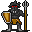 | **Dark Troll** | hard | 55 | 15 | +4 | 2d6+2 | 6 | 100 | 15–45 | humanoid |
|  | **Ogre Lord** | hard | 55 | 15 | +4 | 2d6+2 | 6 | 100 | 15–45 | humanoid |
|  | **Vampire** | hard | 55 | 16 | +4 | 2d6+2 | 6 | 100 | 15–45 | undead, humanoid |
|  | **Wyvern** | hard | 60 | 14 | +4 | 2d4 | 4 | 120 | 3–25 | hit-and-run 1 |
|  | **Mind Flayer** | deadly | 50 | 15 | +6 | 1d6 | 3 | 140 | 25–90 |  |
|  | **Vampire Lord** | deadly | 60 | 16 | +7 | 1d10 | 4 | 160 | 50–150 | undead, humanoid, hit-and-run 1 |
|  | **Spirit Drake** | deadly | 70 | 17 | +6 | 3d8 | 7 | 175 | 40–110 |  |
|  | **Fallen Seraph** | deadly | 80 | 18 | +6 | 3d8 | 9 | 175 | 40–110 | humanoid |
| 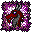 | **Spirit Dragon** | deadly | 80 | 17 | +6 | 3d12 | 7 | 175 | 40–110 |  |
|  | **Fire Giant** | deadly | 95 | 17 | +6 | 3d8 | 7 | 175 | 40–110 | humanoid |
|  | **Crimson Hydra** | deadly | 100 | 17 | +6 | 3d6 | 7 | 175 | 40–110 |  |
|  | **Balor** | deadly | 110 | 18 | +7 | 3d8+2 | 7 | 210 | 60–150 | humanoid, hit-and-run 1 |
|  | **Hydra** | deadly | 110 | 15 | +6 | 3d8+2 | 2 | 190 | 40–120 |  |
|  | **Stone Golem** | deadly | 110 | 18 | +6 | 2d12 | 1 | 205 | 30–80 |  |
|  | **Demon Lord** | boss | 125 | 18 | +6 | 4d8 | 6 | 335 | 120–300 | humanoid |
|  | **Dragon** | boss | 125 | 18 | +6 | 4d8 | 8 | 335 | 20–50 | hit-and-run 2 |
|  | **Pit Fiend** | boss | 145 | 19 | +7 | 4d8+1 | 6 | 360 | 140–320 | humanoid |

<!-- END GENERATED: monsters -->

## Frequently Asked Questions

### What Should I Do First?

On your very first playthrough, your party will start off weak with only a few sticks and stones as weapons. If you are lucky, you will have some camping supplies and a handful of gold coins to use for supplies. The world map is full of hostile creatures and dangerous locations, so your best bet is to find the nearest town.

Once you in town, talk to the townspeople and you will find people with interesting things to say about the world you found yourself in. Some people will have quests that you can go on to gain gold and experience and some people will try to sell you their wares.

Get used to the controls, press the "P" key to see the state of your party, manage your inventory and view individual characters. Make sure each is ready for the next adventure. Once you have explored town and completed a few quests, it is time to venture out into the far more dangerous world.

Sometimes, you may see the King's Eagle flying nearby. This is King Wellerman's messager and the eagle will have important information that you will need to start your adventure.

### How do I restore HP and MP between fights?

Rest with Camping Supplies from the Party screen, or visit a temple in town.
A Cleric or other healer can also cast healing spells on the party screen
outside of combat. Sometimes, simply spending time in an inn or a grove will slowly replenish your hit points and magic points.

### Where do potion reagents come from?

A Druid or Alchemist in the party gathers reagents automatically while you
travel across foraging terrain (grass, forest, and similar tiles). An
Alchemist can then brew them into potions from the Party screen. The party can also purchase reagents from certain townspeople and counters.

<!--
  OPTIONAL: data-driven FAQ entries.

  If you ever want part of this FAQ generated from game data (the way the
  Class Gallery is), wrap just that portion in a marker pair and add a small
  builder script that rewrites only the text between the markers — exactly
  the pattern in docs/manual/build_class_gallery.py. The markers look like:

    [BEGIN GENERATED: faq]   ...generated entries...   [END GENERATED: faq]

  (use real HTML-comment markers, not these square brackets). Everything
  outside the markers — including all of the hand-written Q&A above — stays
  untouched on every run.
-->
