# Locations Catalog — Desert of the Wilderstep

Source material scanned from reference pages. These are *inspiration notes* — original summaries of each location's concept, mood, and story hooks, written to be browsable. The original scan is embedded under each entry. Eighteen locations, all sharing a sun-blasted desert setting where the line between sand, magic, and the planes runs thin.

> ⚠️ The embedded images are scans of published, copyrighted reference pages. They're fine to keep here as private source material, but the prose below is paraphrased for our own use rather than copied.

## Contents

1. [The Piled Pillar](#1-the-piled-pillar)
2. [The Crystal Cave of Aridon](#2-the-crystal-cave-of-aridon)
3. [The Ziggurat of Amun Sheel](#3-the-ziggurat-of-amun-sheel)
4. [The Temple of Empty Rain](#4-the-temple-of-empty-rain)
5. [The Oasis of Shee'Enn](#5-the-oasis-of-sheeenn)
6. [Arridan's Obelisk](#6-arridans-obelisk)
7. [The Dreaming Cave](#7-the-dreaming-cave)
8. [The Chronos Sanctuary](#8-the-chronos-sanctuary)
9. [The Wandering Bazaar](#9-the-wandering-bazaar)
10. [The Desert Observatory](#10-the-desert-observatory)
11. [The Colossus of Amman](#11-the-colossus-of-amman)
12. [The Lost Fleet of Vallor Frye](#12-the-lost-fleet-of-vallor-frye)
13. [The Mirror Monolith](#13-the-mirror-monolith)
14. [The Nexus Ring](#14-the-nexus-ring)
15. [The Impossible Oasis](#15-the-impossible-oasis)
16. [King Noanmi's Maze](#16-king-noanmis-maze)
17. [The Big Dig at Ribcage Ridge](#17-the-big-dig-at-ribcage-ridge)
18. [The Howling Harpies](#18-the-howling-harpies)
- [Appendix: Desert Obstacles & Random Encounters](#appendix-desert-obstacles--random-encounters)

---

## 1. The Piled Pillar

A 100-foot tower of treasure, raised by a deposed king to honor the gods who fed and watered him in exile — then swallowed and turned to stone by a magical sandstorm, the king with it. Now a glinting monument half-buried in hostile wastes.

**Vibe:** Hubris-as-landmark. Wind that moves wrong. Buried gold that *wants* to be found.
**Hooks:** Unnatural winds hint at evocation magic; the pillar's foundation hides a treasure chest; the more you dig, the more (and richer) the finds — but sand sharks lurk.

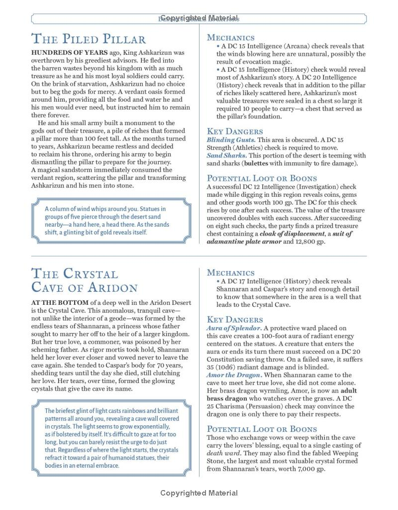

---

## 2. The Crystal Cave of Aridon

A geode-like cave that glows from within. A grieving princess kept vigil over her murdered lover for 70 years; her tears crystallized into the radiant formations, and her spirit became a brass-dragon guardian over the graves.

**Vibe:** Tragic, sacred, dangerously beautiful. A protective radiant ward punishes intruders.
**Hooks:** Lovers who exchange vows here gain a blessing; the largest tear-crystal ("Weeping Stone") is a fabled prize; the guardian dragon can be reasoned with through respect.

*(Pictured above, shared page with the Piled Pillar.)*

---

## 3. The Ziggurat of Amun Sheel

A vain desert bandit-king spent a lifetime's plunder building a step-pyramid carved with his own likeness on every block, then was sealed inside with a priceless silver mirror. Wind has worn his thousand carved faces smooth.

**Vibe:** Lonely monument to ego; a maze of mirrored tunnels inside.
**Hooks:** A loyal band of bandit ghosts (the Red Hand) still guard him; the mirror can summon a fire elemental once per day.

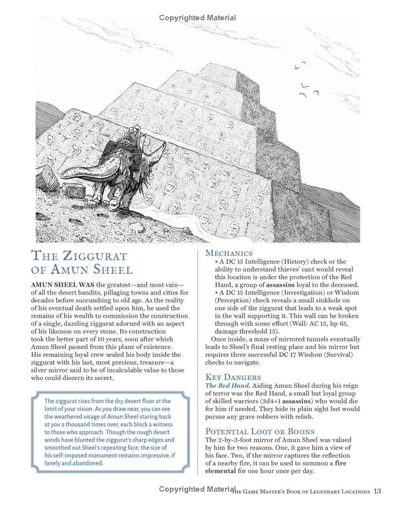

---

## 4. The Temple of Empty Rain

An all-black, alien-looking temple that appeared in the white wastes with no known builder. Raised to honor a minor god of storms — who scorned it. Standing near it feels like walking through water.

**Vibe:** Eerie, silent, wrong. Sensory dread.
**Hooks:** A "transportation chamber" basin pulls anyone who fills it with water onto the elemental plane of water; a hidden alchemy jug holds a fragment of the rain-god's soul.

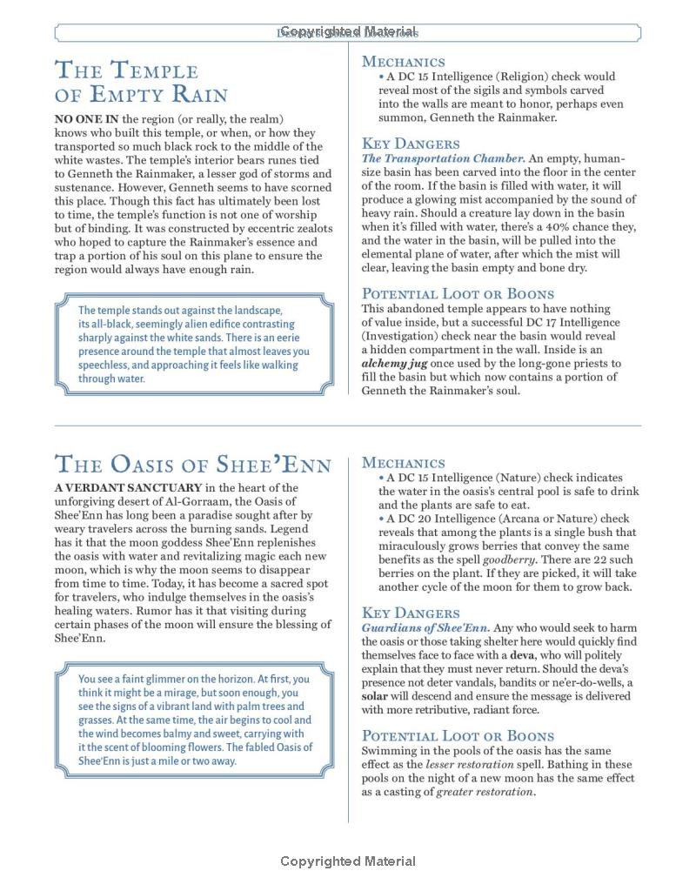

---

## 5. The Oasis of Shee'Enn

A verdant sanctuary tied to a moon goddess, said to replenish under each new moon. A sought-after paradise — and fiercely protected. Any who'd defile it answer to a celestial guardian.

**Vibe:** Lush mirage made real; mercy with teeth.
**Hooks:** Its pools heal (lesser/greater restoration by moon phase); a magical bush grows goodberries; harm-doers face a deva, then a solar.

*(Pictured above, shared page with the Temple of Empty Rain.)*

---

## 6. Arridan's Obelisk

A 70-foot black-basalt spire carved with a slow, ongoing resurrection ritual — one sigil changing per uttered word — built by a wizard-king who sought to overthrow the gods and was buried beneath the sands as a warning.

**Vibe:** A whispering monolith that seems to move; a curse waiting to complete itself.
**Hooks:** Devoted followers became ghouls and wraiths; one warded door, lethal to the unworthy; resting on the wizard's slab grants a level of power.

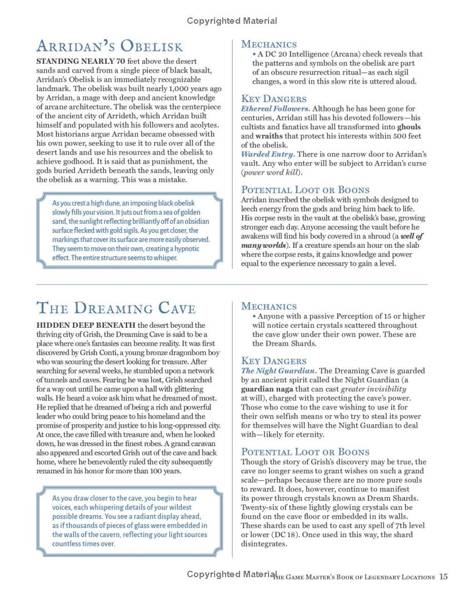

---

## 7. The Dreaming Cave

A cave where fantasies briefly become real. Discovered by a poor dragonborn boy who dreamed himself a benevolent ruler — and woke to find it true, reigning for a century.

**Vibe:** Wish-fulfillment with a shrinking sense of scale; glittering "Dream Shards" embedded in the walls.
**Hooks:** Guarded by the Night Guardian (a greater-invisibility naga); Dream Shards can each cast one high-level spell before crumbling.

*(Pictured above, shared page with Arridan's Obelisk.)*

---

## 8. The Chronos Sanctuary

A hidden oasis built around an enchanted bronze sundial — the "Time Weaver" — that lets a reader glimpse a year into the future, at the risk of pulling duplicate selves from parallel timelines into the present.

**Vibe:** Temporal vertigo; motion-sickness of the soul.
**Hooks:** Only visible when sun and moon share the sky; haunted by "timewraiths" that drain Wisdom and Intelligence; the nearby Temple of Eons holds the world's history in scrolls.

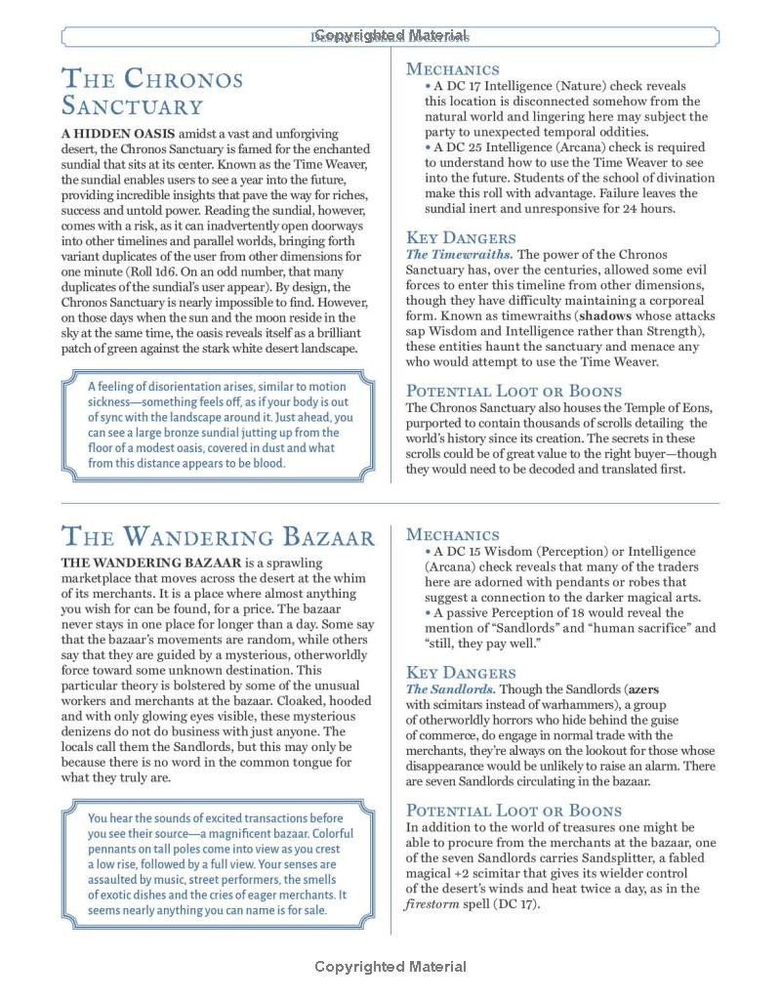

---

## 9. The Wandering Bazaar

A sprawling marketplace that teleports across the desert nightly at its merchants' whim. Almost anything can be bought — for a price — but the vendors deal in darker currencies than coin.

**Vibe:** Riotous color and noise hiding sinister trade ("human sacrifice... and still, they pay well").
**Hooks:** Seven cloaked "Sandlords" (azers in disguise) keep order; one carries a +2 scimitar that commands desert wind and heat (firestorm).

*(Pictured above, shared page with the Chronos Sanctuary.)*

---

## 10. The Desert Observatory

A vast spired-and-domed observatory built by the ancient star-revering Astrans, who studied — and were eventually called away to — the stars. A young scholar, Ishara Bosa, devotes her life to restoring it.

**Vibe:** Awe, cosmic mystery, distant unearthly music. Lingering dread of the "Starfire Incident" that vanished the Astrans.
**Hooks:** Iron-golem "Keepers" guard inner chambers; the "Starstone" powers the great telescope and can show distant worlds — and the astral plane.

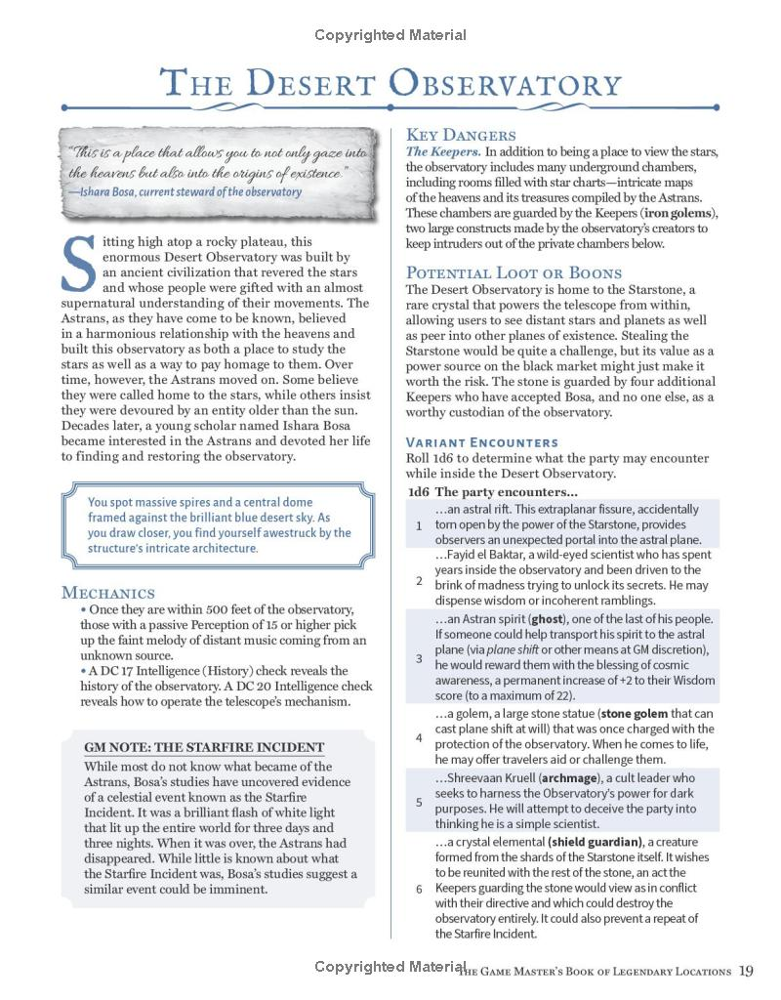

---

## 11. The Colossus of Amman

The toppled iron statue of a once-mighty emperor, half-sunk in the sand — a giant elbow jutting from a dune is the first you see of it. His empire fell because no kingdom outlasts its god.

**Vibe:** Fallen grandeur radiating uneasy power; sudden sandstorms.
**Hooks:** A gargantuan bound djinni (Hadmar) guards the ruins forever; inside the chest sits the "Living Heart Stone," granting djinni-like power to a claimant.

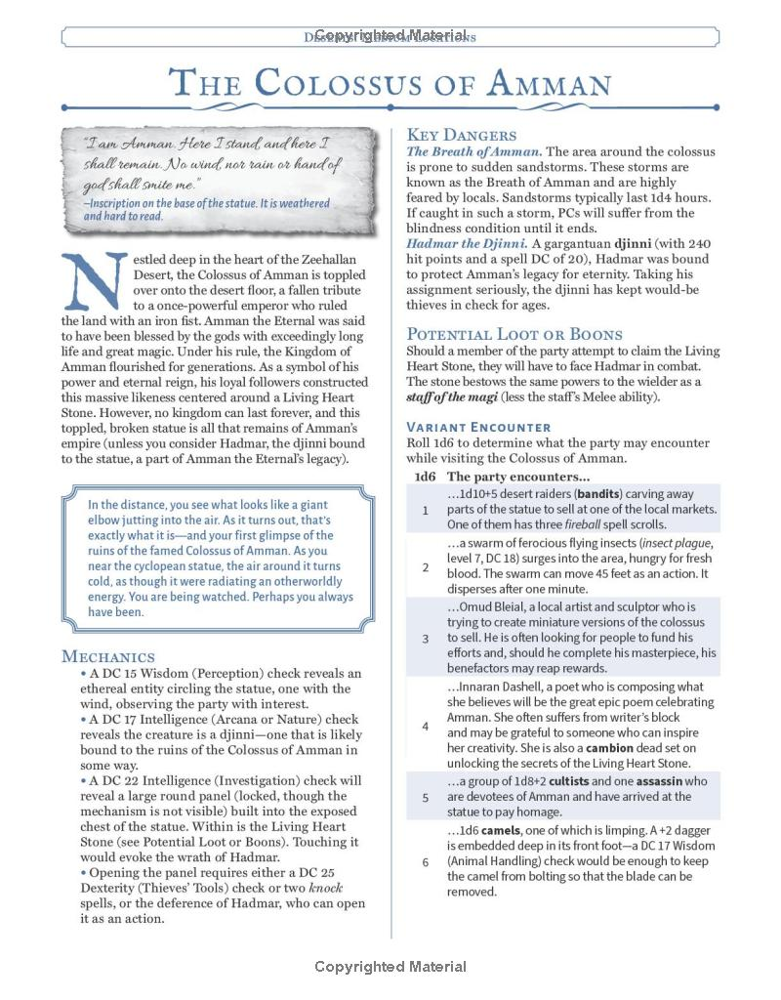

---

## 12. The Lost Fleet of Vallor Frye

A legendary explorer's entire ocean fleet, marooned in the deep desert when the seas retreated mid-storm. Masts now rise from the sand like a drowned forest — the Valley of Vessels.

**Vibe:** Ghost ships on golden waves; melancholy and grandeur.
**Hooks:** Undead "Skeleton Crew" still defend the ships; the Historians' Guild bars looters; the flagship hides the "Heart of the Tide" pendant (tsunami-caller, but cursed) and forgotten treasure charts.

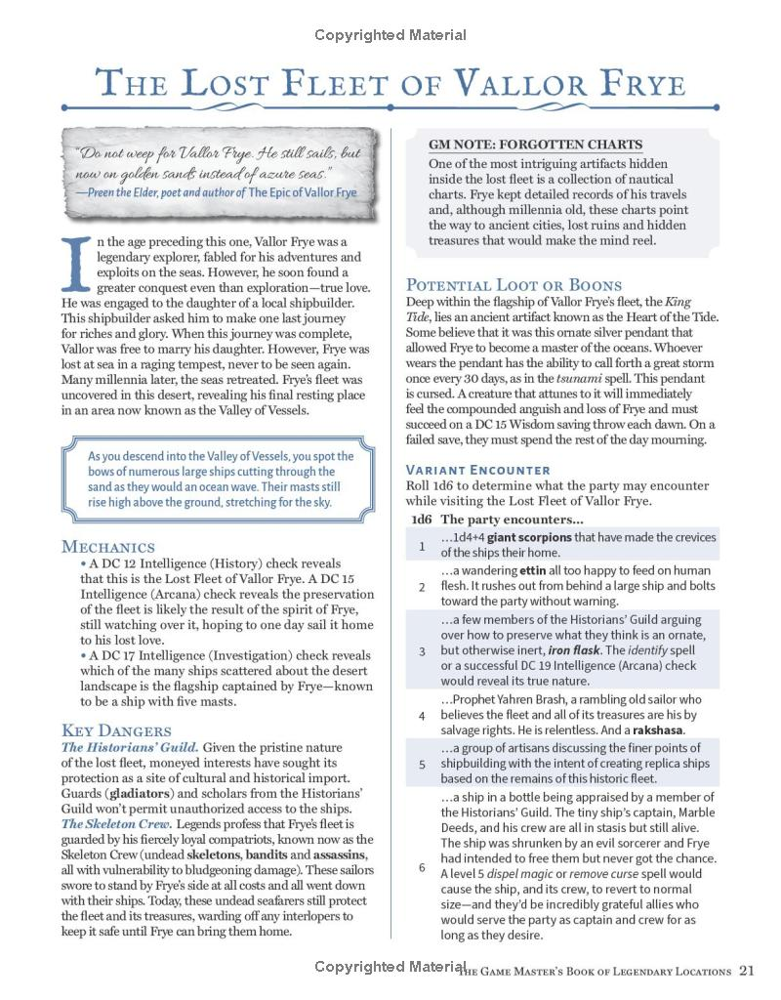

---

## 13. The Mirror Monolith

A 40-by-20-foot glass slab on a plateau that perfectly mirrors the desert — yet feels like a doorway. Onlookers see themselves as they are, as they wish to be, or as glimpses of other worlds and their own darkest depths.

**Vibe:** Hypnotic, mind-warping, secretly a comms channel to the Shee'on (devas).
**Hooks:** Staring too long drives you mad (compelling visions); a mirrored disc near the maker's remains can cast confusion, counterspell, and mirror image.

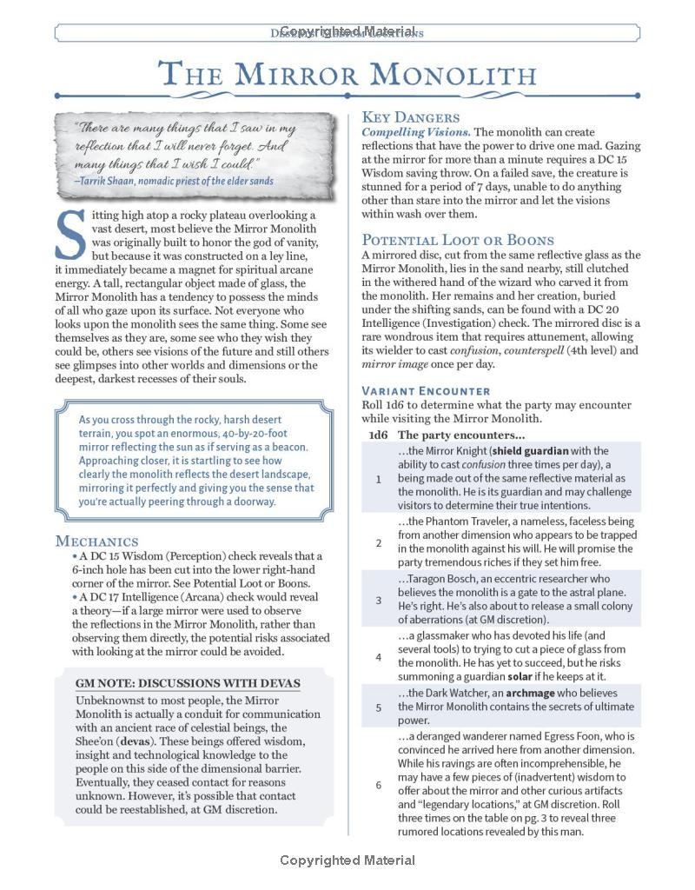

---

## 14. The Nexus Ring

A stone circle of impossibly large megaliths aligned to the rising and setting of both sun and moon — part calendar, part gateway, drawing potent planar energy when the veil is thinnest.

**Vibe:** A deep, disquieting hum; light-drinking black stones.
**Hooks:** Any spell cast within absorbs into the ring; absorb enough and you summon the "Nexus Behemoth" (a CR-heavy aberration); the "Star Lens" amulet grants foresight.

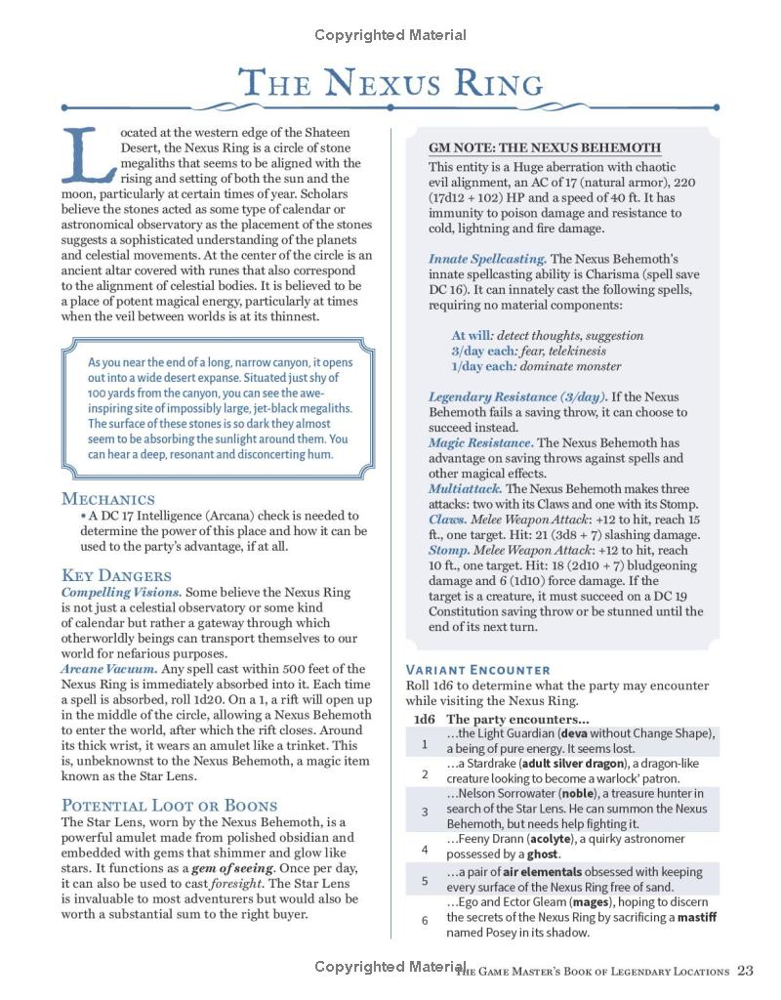

---

## 15. The Impossible Oasis

Forty acres of freshwater springs and fruit trees in the cruelest desert on the map, conjured from a single shrub by a heartbroken warlock — Pendergast the Purple — who wanted "comfort and no small amount of panache."

**Vibe:** Lavish paradise with a petty, dangerous heart; impossibly large produce.
**Hooks:** A booby-trapped cave ("the Stormorb") holds a weather-controlling glass sphere; a "Mystery Predator" (chimera, ancient blue dragon, pit fiend, or marilith) may have moved in.

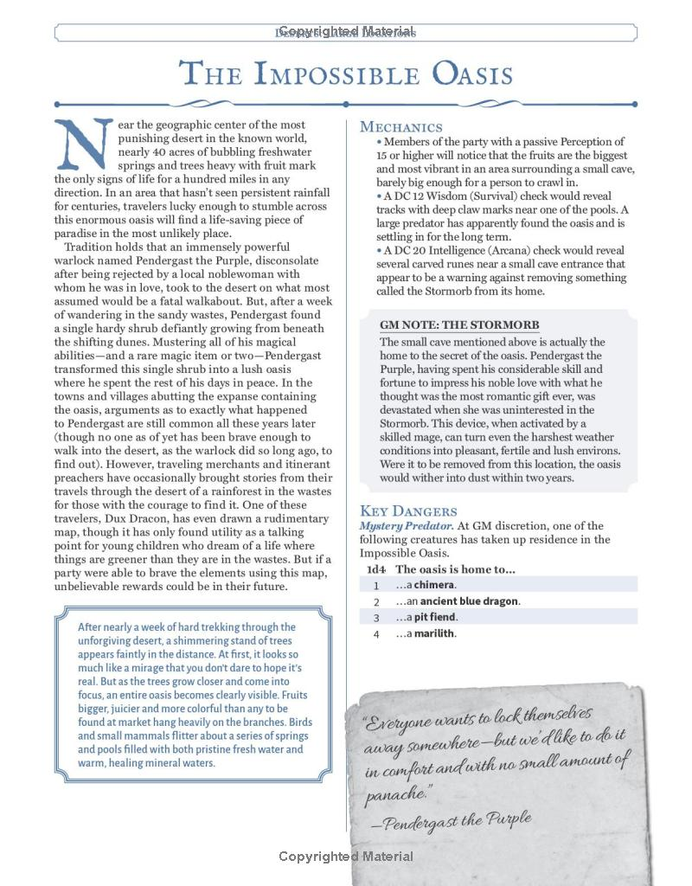

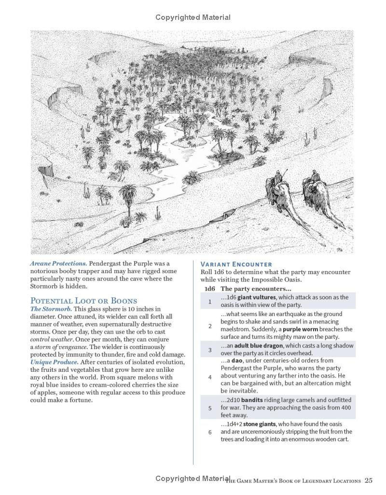

---

## 16. King Noanmi's Maze

A miles-wide labyrinth carved into terraced sandstone cliffs by a paranoid usurper-king to imprison his own monstrous children — five demonic offspring — while protecting the artifact that secures his unnatural immortality.

**Vibe:** A dungeon-within-a-dungeon of deceptive glyphs and grotesque guardians.
**Hooks:** Five named demon-children roam the halls; "Glyphs of Deceit" mimic helpful spells but unleash harmful ones; the center holds ~12,000 gp and a semi-phylactery (periapt of wound closure + ring of regeneration) that, if attuned, leaves the king vulnerable to regicide.

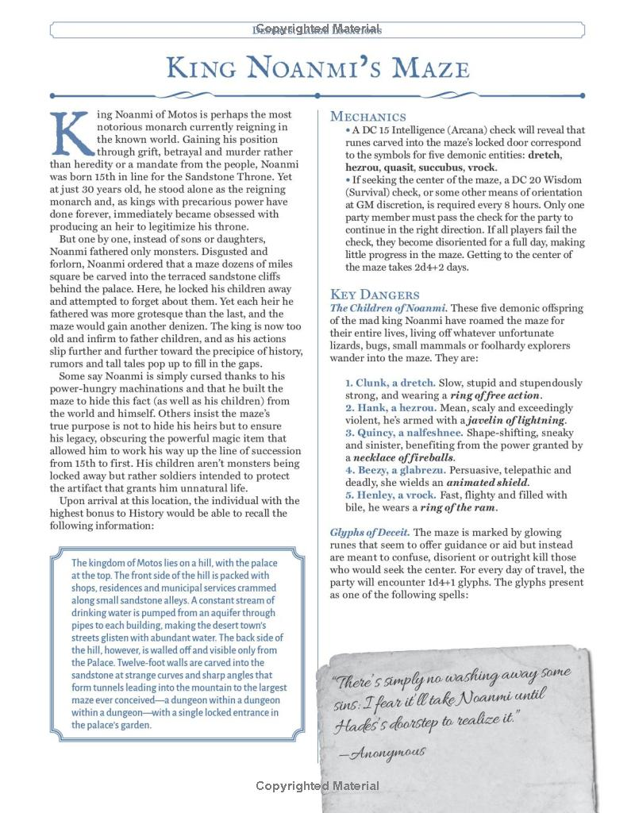

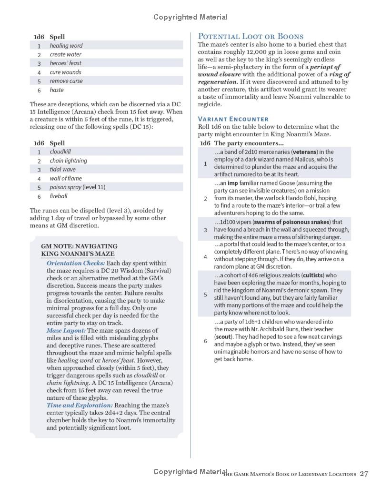

---

## 17. The Big Dig at Ribcage Ridge

A century-long archaeological dig unearthing the colossal fossil skeleton of a prehistoric megabeast — except the skull belongs to the "Ancient Host," an abyssal predator older than the planes, and digging is waking it.

**Vibe:** Feverish, obsessive labor; blood and sweat feeding a buried god back to life. A "war on two fronts" — stop the monster while stopping the workers from sacrificing themselves to it.
**Hooks:** Necrotic bacteria poisons the site; zealous, mind-charmed diggers; loot includes a "Fossilized Dragon's Eye" (true seeing) and a "Tome of Abyssal Lore."

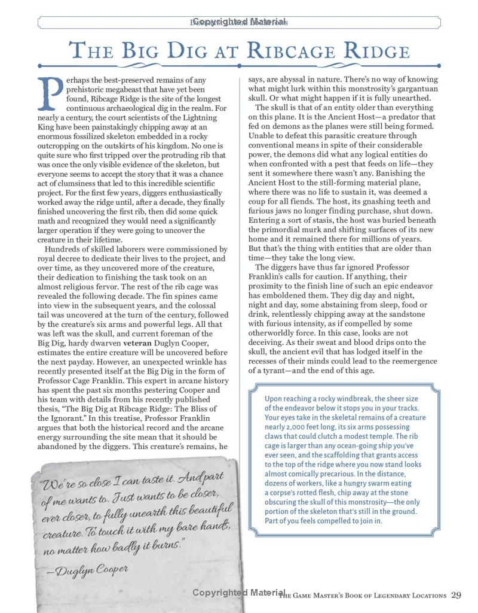

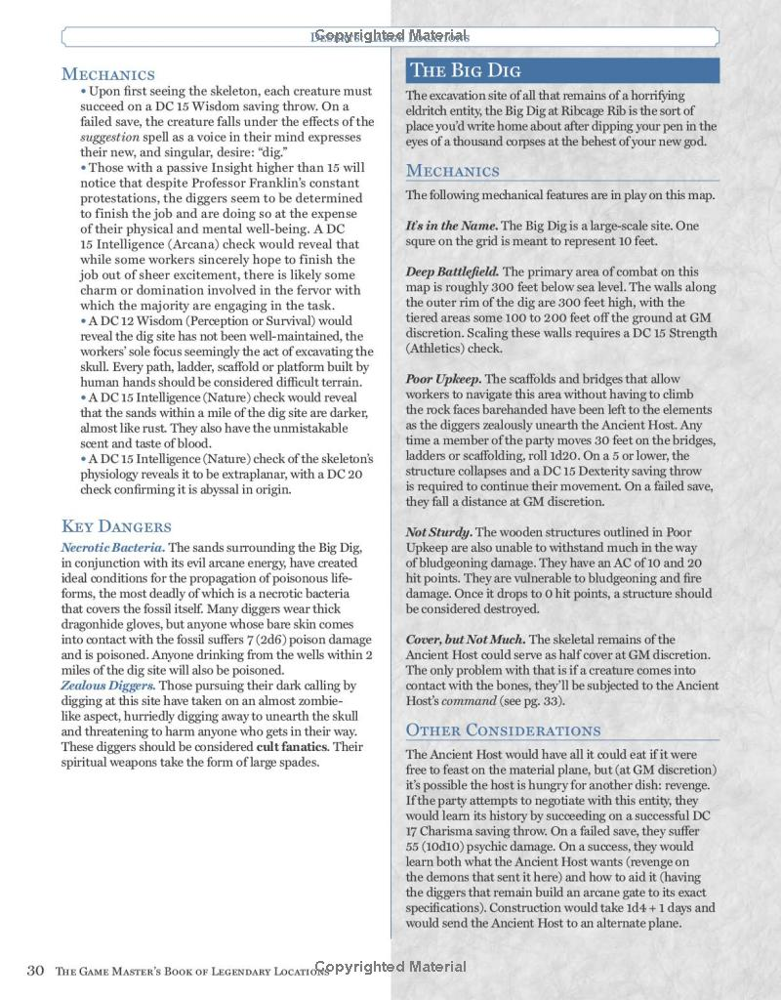

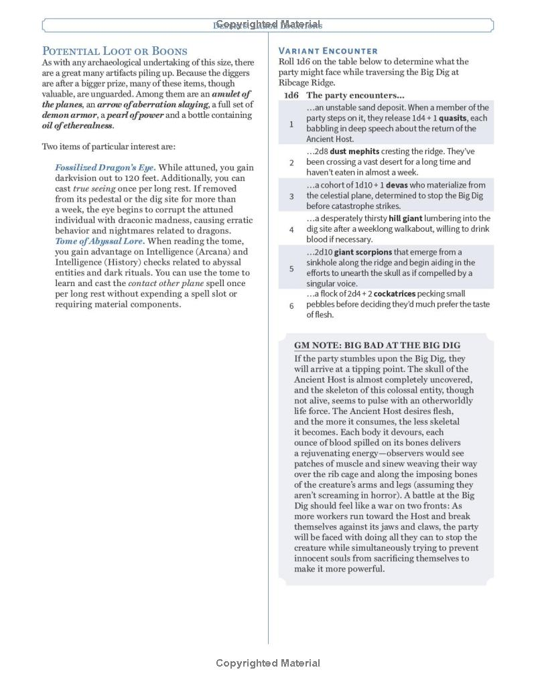

### The Ancient Host (the monster within)

A titanic abyssal aberration (CR 14) that lures prey close via mind control, then bathes in their blood to rebuild flesh over its skeleton. Banished to starve when the prime material was young; now whispering "Dig. Bleed and dig." Full stat block with legendary and lair actions.

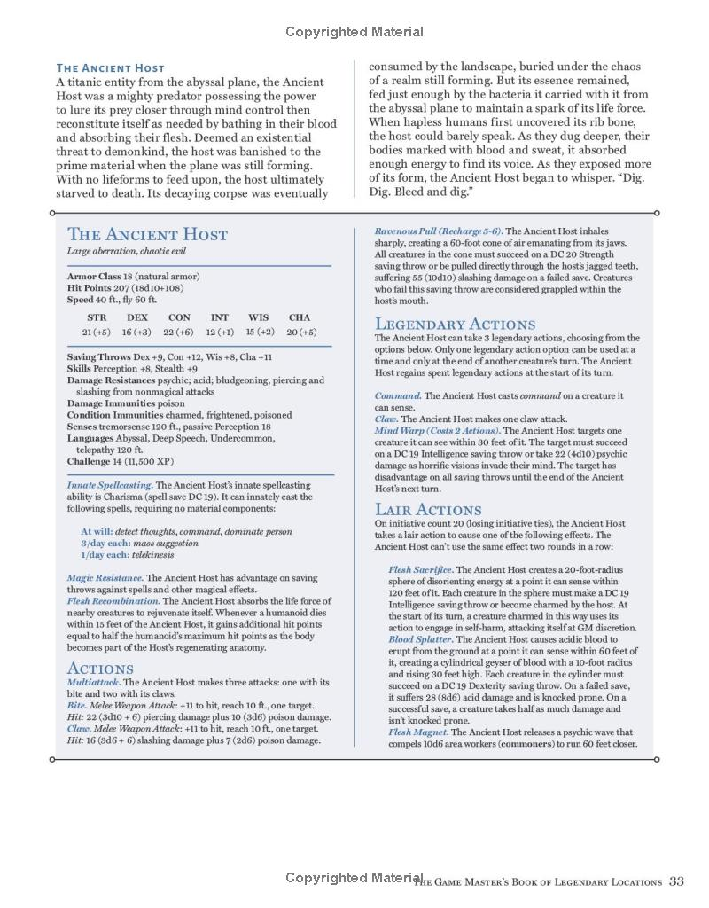

---

## 18. The Howling Harpies

Less a place than a power: a trio of treasure-hunters-turned-bandits who built an omnipresent whisper-network across the desert. Every newcomer asking about ruins or treasure gets reported — then robbed.

**Vibe:** Information as a weapon; innkeepers and shopkeepers on the payroll everywhere.
**Leadership:** Bella Darling, "Bella the Beguiling," a winged tiefling (NE, CR 9) with a succubus's charm and a fey queen's cunning, backed by the brutish Rearview brothers, Grimace and Tad.
**Hooks:** They strike via proxies and simulacrums; cut their funding and the whole structure collapses.

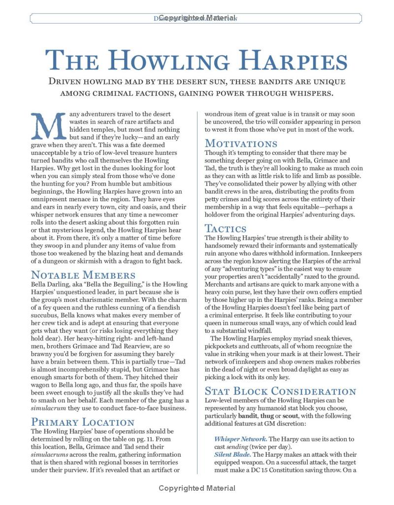

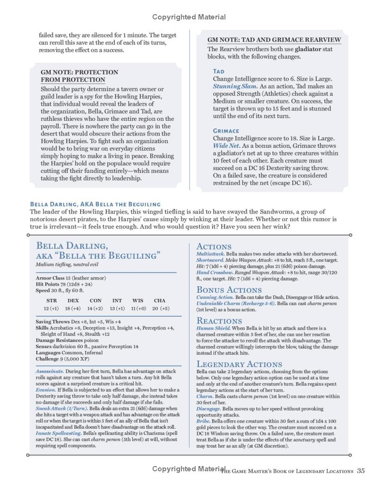

---

## Appendix: Desert Obstacles & Random Encounters

A d20 table of hazards and encounters for travel between locations: sandstorm surges, oasis ambushes, maddening mirages, burrowing desert worms, magical meteor showers, scorpion swarms, disguised cactus-goblins, deadly slot canyons, and merchant caravans.

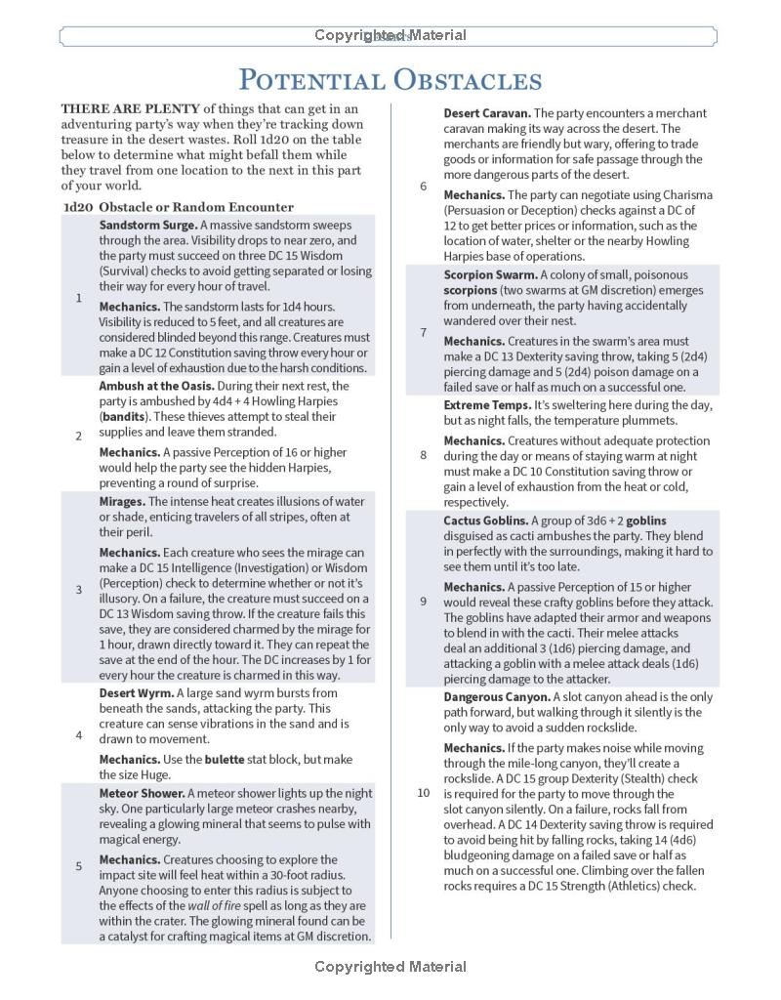
